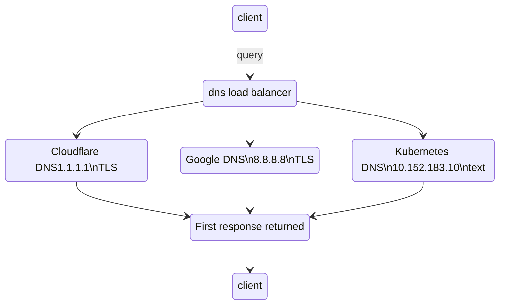

# dns-load-balancer

A fast and flexible DNS forwarder designed for modern multi-environment setups.
It queries multiple upstream DNS servers in parallel (with optional DNS-over-TLS), and returns the first successful response — no more waiting for broken or unreachable DNS endpoints to timeout.

## ✨ Why use this?

If you’ve ever:
- Used a VPN to access internal DNS (e.g., Kubernetes `cluster.local` services)
- Had DNS fail or hang when the VPN dropped
- Manually edited `/etc/resolv.conf` to switch between internal and public DNS
- Needed to mix plaintext and TLS-based DNS forwarders

...then `dns-load-balancer` solves that cleanly.

It acts as a local resolver that can:
- Query several upstream servers in parallel
- Short-circuit and respond as soon as **any** server returns a valid response
- Use **DNS-over-TLS** (DoT) selectively per upstream
- Handle quirks like Kubernetes `cluster.local` domains gracefully

## ⚙️ How it works

When a DNS query is received, `dns-load-balancer`:
1. Sends the request to all configured upstream servers (TLS or plaintext)
2. Returns the **first successful response** (A/AAAA/other)
3. If no valid result is found, returns a not-found error

For `cluster.local` queries, it can be configured to ignore non-`A` requests (e.g., AAAA) to reduce latency in environments like Kubernetes.

## 🛠 Installation

### Option 1: Homebrew (macOS & Linux)

```sh
brew tap kometen/dns-load-balancer
brew install dns-load-balancer
```

### Option 2: Manual (FreeBSD)

**Prerequisites:**

```sh
pkg install rust cmake llvm
cargo install --locked bindgen-cli
export LIBCLANG_PATH=/usr/local/llvm19/lib/libclang.so
```

**Build and install:**

```sh
cargo build --release
cp ./target/release/dns_load_balancer /usr/local/bin/dns-load-balancer
```

**Enable as a service:**

1. Copy the `dnsloadbalancer` service file to `/usr/local/etc/rc.d/`

2. Make it executable:

```sh
chmod 0755 /usr/local/etc/rc.d/dnsloadbalancer
```

3. Add to `/etc/rc.conf`:

```sh
dnsloadbalancer_enable="YES"
```

4. Start it:

```sh
service dnsloadbalancer start
```

## 🔧 Configuration

Generate an example config:

```sh
dns-load-balancer example > /usr/local/etc/dns-load-balancer.toml
```

Edit it to your needs:

```toml
[[servers]]
address = "1.1.1.1"
use_tls = true
description = "Cloudflare DNS"

[[servers]]
address = "8.8.8.8"
use_tls = true
description = "Google DNS"

[[servers]]
address = "10.152.183.10"
use_tls = false
description = "Kubernetes internal DNS"
```

If you want to run on port 53 (privileged), run as root or via a service manager. Otherwise, you can choose any unprivileged port (e.g., 5353) and configure BIND to forward to it.

## 🧩 Integrating with BIND

To use `dns-load-balancer` as a forwarder for BIND:

In `named.conf`:
```conf
options {
    listen-on { 10.254.253.4; }; // Your primary interface
    forwarders {
        127.0.0.1 port 5353;
    };
    forward only;
};
```

## ✅ Example Use Case

```sh
$ host postgresql.invoice.svc.cluster.local
postgresql.invoice.svc.cluster.local has address 10.152.183.95
```

When disconnected from VPN:

```sh
DNS resolution failed: Failed to resolve hostname: postgresql.invoice.svc.cluster.local.
Root cause: no record found for Query { name: ..., type: AAAA }
```

Without needing to change config, the load balancer continues resolving public domains using Cloudflare or Google DNS, and will only fail for cluster-specific records when the VPN is down.

## 📦 Features
	•	✅ Parallel DNS querying
	•	✅ DNS-over-TLS (DoT) support
	•	✅ Kubernetes-aware: filter non-A records
	•	✅ Simple TOML config
	•	✅ Usable as a local forwarder for BIND, Unbound, etc.
	•	✅ Works on FreeBSD, Linux, macOS

💡 Inspired by a real need

This project was built to avoid DNS pain when juggling public and private networks, especially when VPNs are flaky or DNS servers are inconsistent. It started as a quick solution built with Claude AI and Rust — and turned out to be much more useful than expected.

⸻

Feel free to contribute, file issues, or fork for your own use cases.
Happy resolving! 🎉


